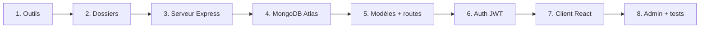

# 1. Guide de réalisation du projet

On reconstruit CraveDash en 8 phases, dans cet ordre : d'abord le serveur (backend), puis la base de données, puis l'interface (frontend). Chaque phase se teste avant de passer à la suivante.



Le serveur tourne sur le port 5001, le client sur le port 5173. Vite redirige tous les appels `/api` du client vers le serveur.

## Phase 1 — Installer les outils

1. Installer **Node.js** (version 20 ou plus) depuis nodejs.org. Vérifier dans le terminal : `node -v` et `npm -v`.
2. Installer **VS Code** et **Git**. Vérifier : `git --version`.
3. Créer un compte **MongoDB Atlas** (gratuit) — voir la section 4.
4. Installer **Postman** ou l'extension VS Code **Thunder Client** pour tester l'API.

## Phase 2 — Créer la structure des dossiers

```bash
mkdir food-app && cd food-app
git init
mkdir server client
```

On sépare `server` (Node/Express) et `client` (React). Ce sont deux programmes différents, chacun avec son propre `package.json`.

## Phase 3 — Démarrer le serveur Express

```bash
cd server
npm init -y
npm install express cors dotenv mongoose bcryptjs jsonwebtoken
npm install -D nodemon
```

1. Dans `server/package.json`, ajouter `"type": "module"` (pour écrire `import` au lieu de `require`).
2. Ajouter les scripts : `"start": "node server.js"` et `"dev": "nodemon server.js"`.
3. Créer `server/.env` (PORT, JWT\_SECRET, MONGO\_URI, NODE\_ENV) et `server/.env.example` (même chose, sans les vraies valeurs).
4. Créer `server/server.js` avec une seule route `/api/health`.
5. Tester : `npm run dev`, puis ouvrir http://localhost:5001/api/health. On doit voir `{"status":"online"}`.

## Phase 4 — Connecter MongoDB Atlas

1. Créer le cluster et l'utilisateur sur Atlas, récupérer l'URI (section 4).
2. Coller l'URI dans `MONGO_URI` du fichier `.env`.
3. Créer `server/config/database.js` avec la fonction `connectDB()`.
4. L'appeler dans `server.js`. Au démarrage on doit lire `✅ MongoDB connecté`.

## Phase 5 — Modèles, contrôleurs, routes

Pour chaque « chose » de l'application (utilisateur, plat, commande), on crée trois fichiers :

| Couche | Dossier | Rôle |
| --- | --- | --- |
| Modèle | `models/` | La forme des données dans MongoDB |
| Contrôleur | `controllers/` | Ce qu'on fait quand une requête arrive |
| Route | `routes/` | Quelle URL appelle quel contrôleur |

1. `models/MenuItem.js` → `controllers/menuController.js` → `routes/menuRoutes.js`.
2. Brancher dans `server.js` : `app.use('/api/menu', menuRoutes)`.
3. Créer `seedMenu.js` et lancer `node seedMenu.js` pour remplir la base avec des plats.
4. Tester `GET http://localhost:5001/api/menu` dans Postman.

## Phase 6 — Authentification JWT

1. `models/User.js` avec le hachage du mot de passe (bcrypt).
2. `controllers/authController.js` : `register`, `login`, `getMe`. Le login renvoie un **token**.
3. `middleware/auth.js` : `requireAuth` (vérifie le token) et `requireAdmin` (vérifie le rôle).
4. `routes/authRoutes.js`, branché sur `/api/auth`.
5. Protéger les routes admin du menu : `router.post('/', requireAuth, requireAdmin, createMenuItem)`.
6. Lancer `node seedUsers.js` pour créer `admin@example.com` et `user@example.com`.
7. Tester dans Postman : login → copier le token → `POST /api/menu` avec l'en-tête `Authorization: Bearer <token>`.

## Phase 7 — Le client React

```bash
cd ../client
npm create vite@latest . -- --template react
npm install
npm install tailwindcss @tailwindcss/vite lucide-react
```

1. `vite.config.js` : ajouter le plugin Tailwind et le **proxy** `/api` → `http://localhost:5001`.
2. `src/index.css` : `@import "tailwindcss";`.
3. `src/services/api.js` : une fonction par route du serveur.
4. `src/context/AuthContext.jsx` (utilisateur + token) et `src/context/CartContext.jsx` (panier).
5. Les composants un par un : `Navbar`, `HeroBanner`, `CategoryFilter`, `FoodCard`, `CartDrawer`, `CheckoutModal`, `OrderTrackerModal`, `AuthPage`.
6. `App.jsx` assemble tout. Lancer : `npm run dev`, ouvrir http://localhost:5173.

## Phase 8 — Espace admin et tests finaux

1. `AdminDashboard.jsx` : liste des plats, formulaire d'ajout, commandes, rapports.
2. Parcours de test : se connecter en admin → ajouter un plat → le voir côté client → passer une commande en client → changer son statut en admin.
3. Committer et pousser : `git add . && git commit -m "..." && git push`.

Règle d'or : ne passe jamais à la phase suivante si la précédente ne marche pas dans Postman ou dans le navigateur.

---
Projet CraveDash (food-app) — documentation, 23 septembre 2026.
