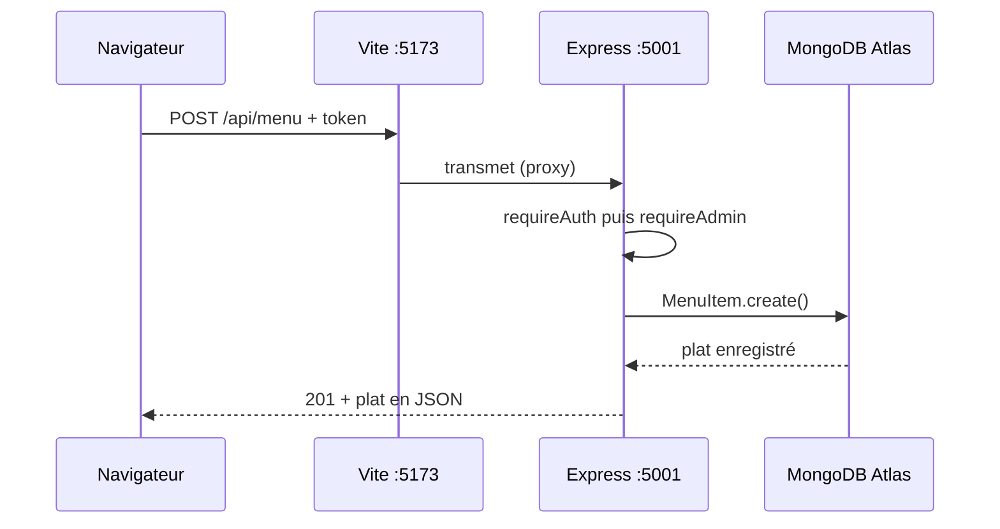

# 5. L'API REST — comment l'utiliser étape par étape

L'API compte 16 routes sous `http://localhost:5001/api`, réparties en 3 groupes : `auth`, `menu`, `orders`. Les routes admin exigent un token d'un compte `admin`.

## 5.1 Principe d'une requête

Une requête HTTP a 4 parties :

- **Méthode** : `GET` (lire), `POST` (créer), `PUT` / `PATCH` (modifier), `DELETE` (supprimer).
- **URL** : par exemple `http://localhost:5001/api/menu`.
- **En-têtes (headers)** : `Content-Type: application/json` quand on envoie du JSON ; `Authorization: Bearer <token>` pour les routes protégées.
- **Corps (body)** : les données en JSON, pour `POST`, `PUT` et `PATCH`.



## 5.2 Liste complète des routes

| Méthode | URL | Protection | Rôle |
| --- | --- | --- | --- |
| GET | `/api/health` | Aucune | Vérifier que le serveur tourne |
| POST | `/api/auth/register` | Aucune | Créer un compte client |
| POST | `/api/auth/login` | Aucune | Se connecter, recevoir un token |
| GET | `/api/auth/me` | Token | Mon profil |
| GET | `/api/menu` | Aucune | Liste des plats (filtres `category`, `search`, `vegOnly`) |
| GET | `/api/menu/categories` | Aucune | Liste des catégories |
| GET | `/api/menu/:id` | Aucune | Un plat |
| POST | `/api/menu` | Token admin | Ajouter un plat |
| PUT | `/api/menu/:id` | Token admin | Modifier un plat |
| DELETE | `/api/menu/:id` | Token admin | Supprimer un plat |
| POST | `/api/orders` | Token facultatif | Passer une commande (client ou invité) |
| GET | `/api/orders/:id` | Aucune | Suivre une commande |
| GET | `/api/orders/user/history` | Token | Mes commandes |
| GET | `/api/orders/admin/all` | Token admin | Toutes les commandes |
| GET | `/api/orders/admin/reports` | Token admin | Rapports (`period`, `date`, `month`, `year`) |
| PATCH | `/api/orders/admin/:id/status` | Token admin | Changer le statut |

## 5.3 Tester avec Postman ou Thunder Client, étape par étape

**Étape 1 — Vérifier le serveur.** Nouvelle requête `GET http://localhost:5001/api/health` → **Send**. Réponse attendue :

```json
{ "status": "online", "timestamp": "2026-09-23T10:00:00.000Z", "service": "Food Ordering Platform API" }
```

**Étape 2 — Se connecter en admin.** `POST http://localhost:5001/api/auth/login`. Onglet **Body** → **raw** → **JSON** :

```json
{ "email": "admin@example.com", "password": "admin123" }
```

Réponse (200) :

```json
{
  "message": "Connexion réussie",
  "token": "eyJhbGciOiJIUzI1NiIsInR5cCI6IkpXVCJ9...",
  "user": { "_id": "66f1...", "name": "Restaurant Manager", "email": "admin@example.com", "role": "admin" }
}
```

**Copier la valeur de `token`.**

**Étape 3 — Ajouter le token.** Dans la requête suivante : onglet **Authorization** → type **Bearer Token** → coller le token. (Ou onglet **Headers** : clé `Authorization`, valeur `Bearer eyJhbGci...`.)

**Étape 4 — Ajouter un plat.** `POST http://localhost:5001/api/menu`, avec le token, et ce corps :

```json
{
  "name": "Tacos poulet",
  "category": "Burgers",
  "price": 11.5,
  "description": "Tacos au poulet grillé et sauce fromagère",
  "image": "https://images.unsplash.com/photo-1565299585323-38d6b0865b47",
  "isVeg": false,
  "prepTime": "15 min",
  "isPopular": true
}
```

Réponse 201 : `{ "message": "Plat ajouté avec succès", "item": { "_id": "66f2...", ... } }`. **Copier le `_id`.**

**Étape 5 — Lire le menu.** `GET http://localhost:5001/api/menu?category=Burgers&search=tacos`. Le nouveau plat apparaît.

**Étape 6 — Modifier le plat.** `PUT http://localhost:5001/api/menu/66f2...` (le `_id`), avec le token, corps : `{ "price": 12, "isAvailable": false }`. Seuls ces champs changent.

**Étape 7 — Supprimer le plat.** `DELETE http://localhost:5001/api/menu/66f2...` avec le token → `{ "message": "Plat supprimé avec succès" }`.

**Étape 8 — Passer une commande.** `POST http://localhost:5001/api/orders` (token facultatif) :

```json
{
  "items": [ { "id": "ID_DU_PLAT", "quantity": 2 } ],
  "deliveryAddress": "12 rue de la Paix, Paris",
  "phone": "0612345678",
  "paymentMethod": "Cash on Delivery",
  "deliveryNotes": "Code 1234"
}
```

Le serveur ignore tout prix envoyé : il relit le prix réel, ajoute 8 % de taxe et 3,50 de livraison sous 45.

**Étape 9 — Changer le statut (admin).** `PATCH http://localhost:5001/api/orders/admin/ID_COMMANDE/status`, avec le token, corps : `{ "status": "Preparing Food" }`. Valeurs acceptées : `Order Placed`, `Preparing Food`, `Out for Delivery`, `Delivered`, `Cancelled`.

**Étape 10 — Rapports.** `GET http://localhost:5001/api/orders/admin/reports?period=monthly&month=2026-09`. `period` vaut `daily` (avec `date=2026-09-23`), `monthly` (avec `month`) ou `annual` (avec `year=2026`).

## 5.4 Codes de réponse

| Code | Sens | Exemple dans l'appli |
| --- | --- | --- |
| 200 | OK | Lecture du menu, login réussi |
| 201 | Créé | Inscription, plat ajouté, commande passée |
| 400 | Requête invalide | Champ manquant, email déjà pris, statut inconnu, plat épuisé |
| 401 | Non authentifié | Pas de token, mauvais mot de passe |
| 403 | Interdit | Token invalide ou expiré ; compte non admin sur une route admin |
| 404 | Introuvable | Plat ou commande inexistant, URL inconnue |
| 500 | Erreur serveur | Problème base de données ou bug |

## 5.5 Utiliser l'API depuis React

Dans un composant, on ne fait jamais `fetch` directement : on passe par `services/api.js`.

```jsx
import { api } from '../services/api';
import { useAuth } from '../context/AuthContext';

const { token } = useAuth();

const ajouter = async () => {
  try {
    const data = await api.createMenuItem({ name: 'Tacos', category: 'Burgers', price: 11.5 }, token);
    console.log('Créé :', data.item);
  } catch (err) {
    alert(err.message);
  }
};
```

1. `useAuth()` donne le token enregistré à la connexion.
2. `api.createMenuItem(données, token)` envoie la requête avec l'en-tête `Authorization`.
3. Si le serveur répond une erreur, `api.js` lance une `Error` avec le message du serveur, qu'on affiche.

Pour ajouter une nouvelle route : (1) la fonction dans le contrôleur, (2) la ligne dans le fichier `routes/`, (3) la fonction dans `api.js`, (4) l'appel dans le composant.

---
Projet CraveDash (food-app) — documentation, 23 septembre 2026.
