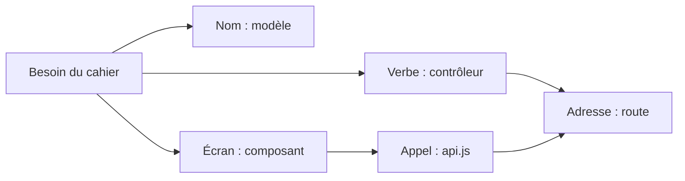

# 6. Pourquoi chaque fichier existe

On ne devine pas les fichiers : on part des besoins du cahier des charges et on applique une méthode fixe. Chaque besoin donne des données (un modèle), des actions (un contrôleur), des adresses (des routes) et un écran (un composant).

## 6.1 La méthode pour savoir quel fichier créer

1. **Lister les « choses »** du cahier des charges (les noms) : utilisateur, plat, commande. Chaque nom devient un **modèle** dans `models/`.
2. **Lister les actions** (les verbes) : s'inscrire, se connecter, ajouter un plat, commander... Chaque groupe d'actions sur une même chose devient un **contrôleur** dans `controllers/`.
3. **Donner une adresse à chaque action** : `POST /api/menu` = ajouter un plat. Chaque groupe d'adresses devient un fichier dans `routes/`.
4. **Repérer le code répété** : « vérifier le token » sert dans 10 routes. On le met une seule fois dans `middleware/`.
5. **Isoler la configuration** : connexion à la base → `config/`, secrets → `.env`.
6. **Côté client, découper l'écran en morceaux** : chaque zone visible (barre du haut, carte de plat, panier) devient un **composant**.
7. **Repérer les données partagées par plusieurs écrans** (utilisateur connecté, panier) → un **contexte** dans `context/`.
8. **Regrouper les appels au serveur** → `services/api.js`.

C'est l'architecture **MVC** (Modèle – Vue – Contrôleur) : le modèle gère les données, le contrôleur la logique, la vue (React) l'affichage.

## 6.2 Exemple complet : « l'admin ajoute un plat » (F12)

1. **Nom** « plat » → il faut stocker nom, prix, catégorie... → `models/MenuItem.js`.
2. **Verbe** « ajouter » → fonction `createMenuItem` → `controllers/menuController.js`.
3. **Adresse** → `POST /api/menu` → ligne dans `routes/menuRoutes.js`, branchée dans `server.js`.
4. **Seul l'admin** → vérifier token et rôle → `middleware/auth.js` (`requireAuth`, `requireAdmin`).
5. **Écran** → un formulaire dans `components/AdminDashboard.jsx`.
6. **Appel** → `createMenuItem()` dans `services/api.js`.
7. **Le token vient d'où ?** → de la connexion, gardé dans `context/AuthContext.jsx`.

## 6.3 Fichiers à la racine

| Fichier | Pourquoi il existe | Comment savoir qu'il le faut |
| --- | --- | --- |
| `package.json` | Scripts pour lancer serveur et client depuis la racine (`npm run server`, `npm run client`, `npm run install-all`) | Pratique dès qu'on a 2 dossiers à lancer ; facultatif |
| `README.md` | Présente le projet et explique comment le lancer | Tout dépôt GitHub en a un ; c'est la première page affichée |

## 6.4 Fichiers du serveur (`server/`)

| Fichier | Pourquoi il existe | Comment savoir qu'il le faut |
| --- | --- | --- |
| `package.json` | Liste les bibliothèques et les scripts `start` / `dev` | Créé par `npm init -y` : obligatoire pour tout projet Node |
| `package-lock.json` | Fige les versions exactes installées | Créé automatiquement par `npm install` ; ne jamais l'écrire à la main |
| `.env` | Contient les secrets (clé JWT, URI MongoDB) | Dès qu'une valeur est secrète ou change selon l'ordinateur |
| `.env.example` | Modèle de `.env` sans les vraies valeurs, partageable sur GitHub | Pour qu'un autre développeur sache quelles variables créer |
| `server.js` | Point d'entrée : crée Express, branche les routes, démarre le port | Tout serveur a un fichier de départ ; c'est le `main` du `package.json` |
| `config/database.js` | Fonction de connexion à MongoDB | La connexion est de la configuration, pas de la logique métier : on la sépare |
| `models/User.js` | Forme d'un utilisateur + hachage du mot de passe | Besoins F1/F2 : il faut stocker des comptes |
| `models/MenuItem.js` | Forme d'un plat | Besoins F3 à F6, F12, F13 : il faut stocker des plats |
| `models/Order.js` | Forme d'une commande et numéro auto `ORD-0001` | Besoins F9 à F11, F14 : il faut stocker des commandes |
| `controllers/authController.js` | Inscription, connexion, profil | Les verbes « s'inscrire », « se connecter » |
| `controllers/menuController.js` | Lire, créer, modifier, supprimer des plats | Les verbes sur les plats (CRUD = Create, Read, Update, Delete) |
| `controllers/orderController.js` | Commander, suivre, changer le statut, rapports | Les verbes sur les commandes |
| `routes/authRoutes.js` | Relie `/api/auth/...` aux fonctions d'auth | Un fichier de routes par contrôleur |
| `routes/menuRoutes.js` | Relie `/api/menu/...` et place les protections admin | Idem |
| `routes/orderRoutes.js` | Relie `/api/orders/...` | Idem |
| `middleware/auth.js` | Vérifie le token et le rôle admin | Même vérification dans beaucoup de routes → on l'écrit une fois |
| `seedUsers.js` | Crée les comptes de démo | Impossible de s'inscrire en admin depuis le site : il faut un script |
| `seedMenu.js` | Remplit la base avec 9 plats | Une base vide ne permet pas de tester l'affichage |
| `data/mockData.js` | Liste des plats de départ (version détaillée) | Données de démo réutilisées par `store.js` et `seeder.js` |
| `data/store.js` | Base « en mémoire » utilisée avant MongoDB | Reste de la première version ; encore utilisée par les commandes (section 7) |
| `data/seeder.js` | Remplit utilisateurs, plats et commandes de démo en une fois | Version plus complète des scripts de seed ; pas appelée actuellement |

## 6.5 Fichiers du client (`client/`)

| Fichier | Pourquoi il existe | Comment savoir qu'il le faut |
| --- | --- | --- |
| `package.json`, `package-lock.json` | Dépendances React, Vite, Tailwind | Créés par `npm create vite` |
| `index.html` | La seule page HTML ; contient `
` | Créé par Vite ; React a besoin d'une page où se dessiner |
| `vite.config.js` | Plugins React + Tailwind, port 5173, proxy `/api` | Créé par Vite ; on le modifie pour Tailwind et le proxy |
| `.oxlintrc.json` | Règles du vérificateur de code (`npm run lint`) | Facultatif, pour repérer les erreurs |
| `.gitignore` | Empêche d'envoyer `node_modules` et `dist` sur GitHub | Créé par Vite |
| `public/favicon.svg`, `icons.svg` | Icône de l'onglet, icônes | Fichiers servis tels quels |
| `src/main.jsx` | Démarre React dans `#root` | Créé par Vite ; point d'entrée du client |
| `src/index.css` | Importe Tailwind, styles de base | Pour activer Tailwind |
| `src/App.css` | Styles de l'exemple Vite | Créé par Vite, peu utilisé |
| `src/App.jsx` | Composant racine : choisit l'écran (connexion, admin, boutique) | Il faut un chef d'orchestre qui assemble les composants |
| `src/services/api.js` | Toutes les requêtes vers le serveur | Une fonction par route ; évite de répéter `fetch` partout |
| `src/context/AuthContext.jsx` | Utilisateur et token partagés partout | La Navbar, le checkout et l'admin ont tous besoin de savoir qui est connecté |
| `src/context/CartContext.jsx` | Panier partagé | Les cartes, la Navbar (badge) et le panier modifient le même panier |
| `src/assets/*` | Images (bannière, logos) | Images importées dans les composants |
| `components/AuthPage.jsx` | Première page : connexion, inscription, invité | Besoins F1/F2 |
| `components/AuthModal.jsx` | Connexion en fenêtre depuis la boutique | Se connecter sans quitter la boutique |
| `components/Navbar.jsx` | Recherche, filtre végé, panier, compte | Besoins F5, F6, F7 ; zone visible sur tous les écrans |
| `components/HeroBanner.jsx` | Bannière d'accueil | Zone visuelle séparée |
| `components/CategoryFilter.jsx` | Boutons de catégorie | Besoin F4 |
| `components/FoodCard.jsx` | Carte d'un plat | Besoin F3 ; répétée pour chaque plat → composant réutilisable |
| `components/CartDrawer.jsx` | Panier latéral + code promo | Besoins F7, F8 |
| `components/CheckoutModal.jsx` | Formulaire de commande | Besoin F9 |
| `components/OrderTrackerModal.jsx` | Suivi en 4 étapes | Besoin F10 |
| `components/AdminDashboard.jsx` | Espace admin complet | Besoins F12 à F15 |
| `components/AdminPanelModal.jsx` | Première version de l'admin | Remplacé par `AdminDashboard` ; peut être supprimé |

## 6.6 Ordre de création conseillé

On crée toujours dans le sens des dépendances : un fichier ne peut importer qu'un fichier qui existe déjà.

1. `server/package.json` → `.env` → `server.js` (route health)
2. `config/database.js`
3. `models/MenuItem.js` → `controllers/menuController.js` → `routes/menuRoutes.js` → `seedMenu.js`
4. `models/User.js` → `controllers/authController.js` → `middleware/auth.js` → `routes/authRoutes.js` → `seedUsers.js`
5. `models/Order.js` → `controllers/orderController.js` → `routes/orderRoutes.js`
6. Client : `vite.config.js` → `index.css` → `services/api.js` → `context/AuthContext.jsx` → `context/CartContext.jsx`
7. Composants : `FoodCard` → `CategoryFilter` → `Navbar` → `HeroBanner` → `CartDrawer` → `CheckoutModal` → `OrderTrackerModal` → `AuthPage` → `AdminDashboard`
8. `App.jsx` en dernier (il importe tous les autres).

---
Projet CraveDash (food-app) — documentation, 23 septembre 2026.
